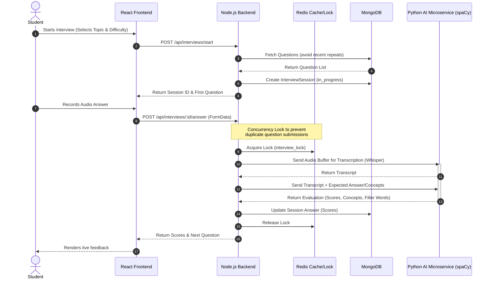

# Student Module

The Student Module is a comprehensive suite of features designed to help learners track their progress, prepare for interviews, build their skill roadmaps, and apply for jobs. It is tightly integrated with the Resume Analyzer and the Recruiter Intelligence pipelines.

---

## 1. System Architecture & Component Interactions

### Mock Interview Workflow

The Mock Interview system uses a Python AI microservice to evaluate student responses in real-time.

### Data Flow Integration
- **Resume Analyzer** -> **Learning Roadmaps**: When a resume is analyzed, missing skills (`gapAnalysis.criticalGaps`) trigger an automatic update to the student's `LearningProgress` roadmap, adding those missing skills as new learning milestones.
- **Mock Interviews** -> **Tutor Feedback**: Tutors can monitor completed interviews, override scores, and trigger real-time Socket.IO notifications to the student.

---

## 2. End-to-End Workflows

### A. Mock Interview System
1. **Session Management**: Students select a topic (e.g., React, Node.js) and difficulty. The backend fetches questions from the `QuestionBank`, specifically filtering out questions the student has seen in their last 3 sessions to ensure variety.
2. **AI Microservice Integration**: 
   - Uses `Whisper` for audio transcription.
   - Evaluates the transcript against `expectedAnswer` and `expectedConcepts` using NLP (`spaCy` + `sentence-transformers`).
   - Generates scores for: Technical Accuracy, Communication Quality, and Concept Relevance.
3. **Concurrency Locking**: Because audio transcription and NLP evaluation can take several seconds, a Redis lock (`interview_lock:{sessionId}`) is used to prevent the user from clicking "Submit" twice and corrupting the session state index.
4. **Fallback Scoring (Fail-Soft Mode)**: If the Python AI service is unreachable or times out, the Node backend catches the error and assigns a mock/zero score, allowing the session to continue gracefully without crashing the frontend.
5. **Tutor Feedback**: Authorized tutors can review a session, adjust the overall score, add specific feedback per answer, and the student receives a real-time Socket.IO notification.

### B. Learning Roadmaps
1. **Dynamic Syncing**: The roadmap is automatically synchronized when the user's active resume gets analyzed.
2. **Job-Readiness Tracking**:
   - `overallProgress` is a pre-save calculated field based on the percentage of completed topics.
   - `readinessBoost` is a virtual field where each verified "contribution" type milestone adds a 5% boost to the user's perceived job readiness score.

### C. Student Dashboard & Job Search
- **Dashboard Aggregation**: The dashboard fetches the latest active resume score, the overall learning progress, and the average mock interview score to present a unified view of the student's readiness.
- **Job Application Workflow**: Students can browse job postings. When applying, the Job Matcher calculates a semantic match score between the student's active resume and the job description.

---

## 3. Database Models

### InterviewSession (`server/src/database/models/InterviewSession.js`)
Tracks the entire lifecycle of a mock interview.
- `userId`: Reference to the Student.
- `status`: `in_progress`, `completed`, `abandoned`.
- `answers`: Array of subdocuments containing the audio transcript, expected vs. detected concepts, technical/communication scores, and tutor overrides.
- `overallScore`: Weighted average calculated upon completion.
- `tutorOverallFeedback`: Manual feedback provided by an assigned tutor.

### LearningProgress (`server/src/database/models/LearningProgress.js`)
Tracks the student's dynamic learning roadmap.
- `roadmap`: Array of `topicProgressSchema` containing the topic name, type (`learning` vs `contribution`), and status.
- `overallProgress`: Pre-save hook calculates percentage of completed topics.
- `tutorsTracking`: Array of Tutor user IDs authorized to view and modify this roadmap.
- **Virtuals**: `hasTutorResources` (checks if a tutor assigned custom URLs) and `readinessBoost` (calculates contribution bonus).

### QuestionBank (`server/src/database/models/QuestionBank.js`)
Stores the pool of interview questions, expected answers, and required concepts for the AI to benchmark against.

---

## 4. API Endpoints

### Interviews
| Method | Endpoint | Description | Auth |
| :--- | :--- | :--- | :--- |
| `POST` | `/api/interviews/start` | Starts a new session, fetches questions | Student |
| `GET` | `/api/interviews/:id` | Get active session details | Student |
| `POST` | `/api/interviews/:id/answer` | Submit audio/text for AI evaluation | Student |
| `POST` | `/api/interviews/:id/complete` | Finalize session and calculate overall score | Student |
| `GET` | `/api/interviews/history` | Paginated interview history | Student |
| `GET` | `/api/interviews/ai-status` | Health check for Python AI Microservice | Any |
| `POST` | `/api/interviews/tutor/sessions/:id/feedback` | Submit manual tutor feedback (Socket trigger) | Tutor |

### Roadmaps
| Method | Endpoint | Description | Auth |
| :--- | :--- | :--- | :--- |
| `GET` | `/api/roadmap/me` | Fetch active roadmap | Student |
| `POST` | `/api/roadmap/sync` | Sync roadmap with resume gap analysis | Student |
| `PATCH`| `/api/roadmap/update-topic` | Mark a milestone as completed | Student |

---

## 5. Key Files Reference

**Frontend Components (`client/src/modules/`)**
- `mock-interview/pages/InterviewLobby.jsx` - Start page for interviews.
- `mock-interview/pages/InterviewSession.jsx` - Main interface handling audio recording.
- `roadmap/pages/RoadmapPage.jsx` - Interactive skill tree viewer.
- `student-jobs/pages/JobBoard.jsx` - Job browsing and application flow.

**Backend Services (`server/src/modules/`)**
- `interviews/controller.js` & `interviews/service.js` - Core session and AI coordination logic.
- `roadmap/controller.js` - Roadmap sync and progress calculation.
- `dashboard/service.js` - Data aggregation for student metrics.

**AI Integration**
- `integrations/aiInterviewService.js` - Node.js wrapper making HTTP calls to the Python FastAPI microservice.
